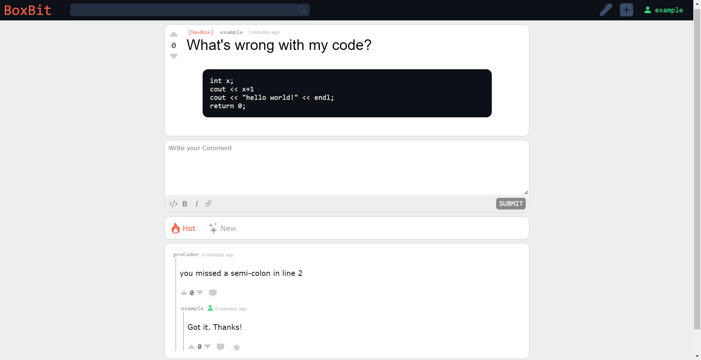
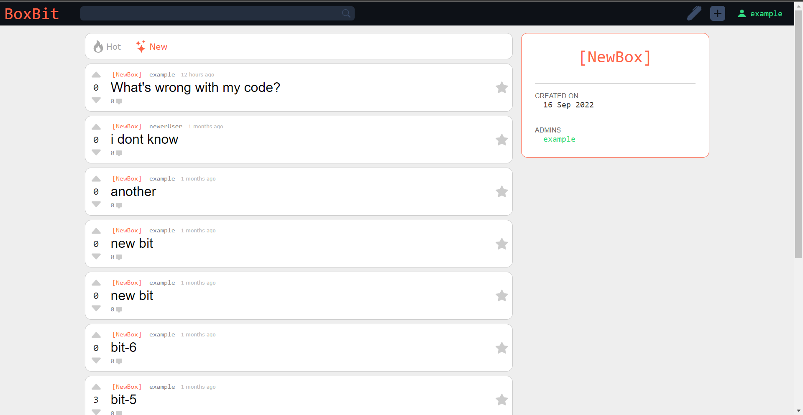
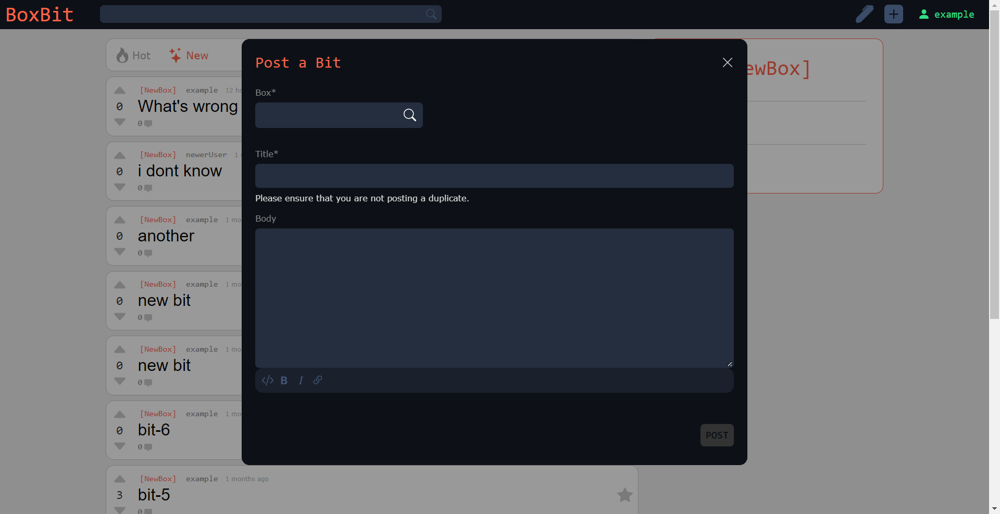
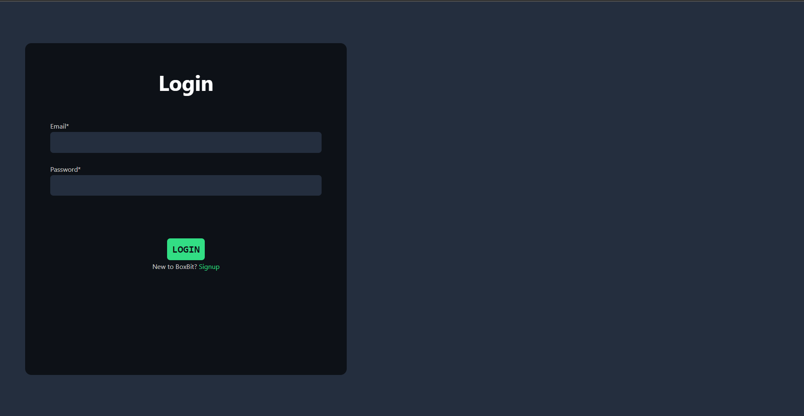

# BoxBit: Reddit Inspired MERN Application
## A hybrid of Reddit and StackExchange
Users can visit a community, upvote questions, and add comments. Questions can be filtered using the "Hot" and "New" buttons. The design for the comments on a question is inspired by Reddit comments. Answers can also be marked as "correct" by the original poster, which is a StackExchange feature.

I developed the backend with ExpressJS, using MongoDB for persistence of data. For authorization, I used JSON Web Tokens. I designed the user interface myself, majorly taking inspiration from Reddit, and then I developed it with ReactJS. I also used React-redux and React-router libraries.

## Features

## Gallery

  
   
  
   
</P
